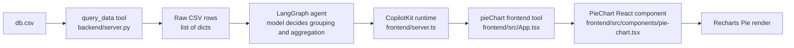
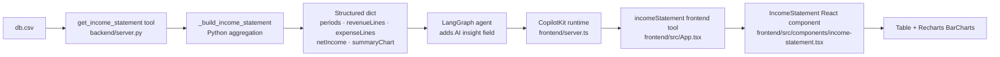

# Chart & Income Statement Data Flow in Lesson 3

This file describes the two distinct paths data takes from the CSV into a rendered UI component.

---

## Path 1 — Pie Chart (model-aggregated)



1. Raw rows live in [db.csv](./db.csv).
2. The Python backend exposes a tool called `query_data` in [backend/server.py](./backend/server.py).
3. `query_data` opens the CSV with `csv.DictReader(...)` and returns all rows as a `list[dict]`.
4. The backend registers that tool on the LangGraph agent with `tools=[query_data]`.
5. The system prompt in [backend/server.py](./backend/server.py) tells the model to call `query_data` before showing a chart.
6. The React app mounts CopilotKit in [frontend/src/main.tsx](./frontend/src/main.tsx) with `runtimeUrl="/api/copilotkit"`.
7. That route is implemented in [frontend/server.ts](./frontend/server.ts), which forwards requests to the Python backend at `http://localhost:8003` through `LangGraphHttpAgent`.
8. In [frontend/src/App.tsx](./frontend/src/App.tsx), the chart UI is registered as a frontend tool named `pieChart` using `useComponent(...)`.
9. The actual chart component lives in [frontend/src/components/pie-chart.tsx](./frontend/src/components/pie-chart.tsx).
10. That component expects props in this shape:

```ts
{
  title: string,
  description: string,
  data: [{ label: string, value: number }]
}
```

11. When the agent decides to use `pieChart`, those props are passed into the React component.
12. Recharts renders the chart with:

```tsx
<Pie data={coloredData} dataKey="value" nameKey="label" />
```

### Important Detail

There is no explicit deterministic ETL step from CSV rows to chart slices for the pie chart.

The ingest path is: `db.csv` → `query_data()` returns raw rows → **model decides grouping and aggregation** → frontend `pieChart` tool called with `{ title, description, data }` → React/Recharts renders it.

---

## Path 2 — Income Statement (deterministic aggregation)



1. The backend exposes a dedicated `get_income_statement()` tool in [backend/server.py](./backend/server.py).
2. That tool calls `_build_income_statement()`, a **deterministic Python function** that:
   - Opens `db.csv` with `csv.DictReader`
   - Groups rows by period (`YYYY-MM`) and by `type` (`income` / `expense`)
   - Builds `revenueLines` and `expenseLines` — one entry per line item with a value per period
   - Computes `revenueTotal`, `expenseTotal`, and `netIncome` arrays (one number per period)
   - Builds `summaryChart` — one object per period with `{ label, revenue, expenses, netIncome }`
3. The system prompt tells the agent: *for P&L / income statement requests, call `get_income_statement` and render through the `incomeStatement` frontend tool*.
4. The agent calls the tool, receives the fully structured dict, then fills in the remaining `insight` field itself.
5. The `insight` field is AI-generated — the agent writes a ≤40-word financial observation. The Zod schema's `.describe()` on that field constrains what the AI should focus on:
   - Name the largest expense line as the cost driver
   - Use "sustained losses" or "volatile losses" based on the actual period-over-period pattern
   - Do not claim "widening losses" unless each period is strictly worse than the last
6. The fully populated props object is sent to the `incomeStatement` frontend tool, registered in [frontend/src/App.tsx](./frontend/src/App.tsx) via `useComponent(...)`.
7. The component lives in [frontend/src/components/income-statement.tsx](./frontend/src/components/income-statement.tsx). Its Zod schema defines the expected shape:

```ts
{
  title: string,
  description: string,
  periods: string[],                          // e.g. ["Jan 2026", "Feb 2026", "Q1 2026 Total"]
  revenueLines: { label: string, values: number[] }[],
  expenseLines: { label: string, values: number[] }[],
  revenueTotal: number[],
  expenseTotal: number[],
  netIncome: number[],
  summaryChart: { label: string, revenue: number, expenses: number, netIncome: number }[],
  insight: string                             // AI-generated, ≤40 words
}
```

8. The component renders three sections:
   - **AI Insight box** — amber callout with the agent-written summary
   - **Monthly Summary bar chart** — grouped bars: Revenue (blue), Expenses (orange), Net Income (green/red)
   - **Line-item table** — Income section, Expenses section, Net Income row with red values for losses
   - **Net Income trend chart** — single-series bar chart, green for profit / red for loss

### Key difference from the pie chart path

| | Pie Chart | Income Statement |
|---|---|---|
| Data tool | `query_data` — returns raw rows | `get_income_statement` — returns aggregated data |
| Aggregation | Done by the LLM at inference time | Done by `_build_income_statement()` in Python |
| AI role | Full ETL + render decision | Insight text only; numbers come from code |
| Props schema | Flat `{ title, description, data[] }` | Rich nested schema with 9 typed fields |
| Correctness guarantee | Depends on model accuracy | Deterministic; totals always match line items |
